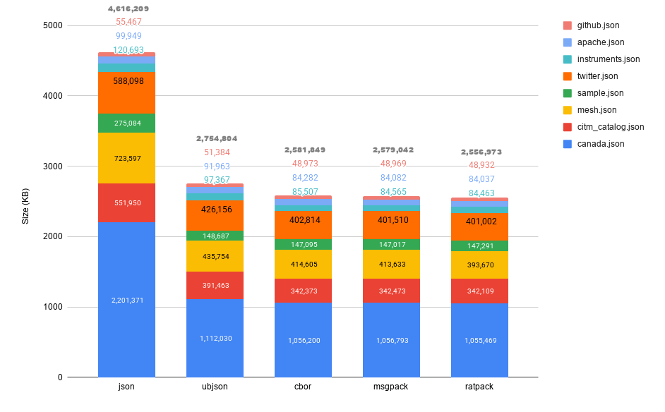

# Benchmarks

This contains some crude benchmarks comparing packrat against JSON and other common serialization
formats.

## Size Comparison



## Full Results
```
Taking the best time out of 10 enc/dec iterations

file: data/apache.json (101711)
          Enc Size    Enc Time    Dec Time
   JSON   99949       0.000528    0.000491
 ubjson   91963       0.000757    0.000486
  cbor2   84282       0.000738    0.000485
msgpack   84082       0.000158    0.000323
packrat   84037       0.000871    0.000971

file: data/mesh.json (752407)
          Enc Size    Enc Time    Dec Time
   JSON   723597      0.010856    0.005040
 ubjson   435754      0.002995    0.002742
  cbor2   414605      0.007625    0.002461
msgpack   413633      0.001204    0.001244
packrat   393670      0.007284    0.009158

file: data/instruments.json (122717)
          Enc Size    Enc Time    Dec Time
   JSON   120693      0.000715    0.000851
 ubjson   97367       0.001082    0.000789
  cbor2   85507       0.001523    0.000794
msgpack   84565       0.000309    0.000620
packrat   84463       0.001534    0.001997

file: data/sample.json (687491)
          Enc Size    Enc Time    Dec Time
   JSON   275084      0.000885    0.001404
 ubjson   148687      0.000770    0.000751
  cbor2   147095      0.000698    maximum container nesting depth (400) exceeded
msgpack   147017      0.000150    0.000679
packrat   147291      0.000823    0.001176

file: data/canada.json (2251051)
          Enc Size    Enc Time    Dec Time
   JSON   2201371     0.044041    0.024235
 ubjson   1112030     0.015395    0.007712
  cbor2   1056200     0.026488    0.008243
msgpack   1056793     0.003310    0.003964
packrat   1055469     0.014227    0.018986

file: data/github.json (55827)
          Enc Size    Enc Time    Dec Time
   JSON   55467       0.000211    0.000185
 ubjson   51384       0.000246    0.000183
  cbor2   48973       0.000248    0.000182
msgpack   48969       0.000063    0.000143
packrat   48932       0.000384    0.000409

file: data/twitter.json (631514)
          Enc Size    Enc Time    Dec Time
   JSON   588098      0.001789    0.002193
 ubjson   426156      0.002554    0.002143
  cbor2   402814      0.002627    0.002127
msgpack   401510      0.000605    0.001705
packrat   401002      0.003789    0.004818

file: data/citm_catalog.json (1727204)
          Enc Size    Enc Time    Dec Time
   JSON   551950      0.003492    0.004010
 ubjson   391463      0.008111    0.004087
  cbor2   342373      0.011380    0.004488
msgpack   342473      0.001598    0.003074
packrat   342109      0.007609    0.010247
```

## JSON inputs used
 - canada.json, citm_catalog.json, twitter.json (https://github.com/miloyip/nativejson-benchmark/tree/master/data)
 - apache.json, github.json, insturments.json, mesh.json (https://github.com/python-rapidjson/python-rapidjson/tree/master/benchmarks/json)
 - sample.json (source https://code.google.com/archive/p/json-test-suite/downloads)
